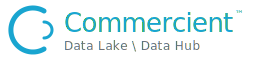

<p align="center">
  
</p>

# dlake — Commercient Data Lake \ Data Hub CLI

`dlake` is the official cross-platform command-line client for the
**Commercient Data Lake \ Data Hub** — in the spirit of the Stripe and HubSpot
CLIs. It authenticates with a tenant API key, manages profiles, and wraps the
platform's REST and admin surfaces with a scripting-friendly UX.

> **Binary distribution.** This repository publishes the official `dlake`
> binaries and release notes. The source code is not published here.

## What is Commercient Data Lake \ Data Hub?

A managed, per-tenant data platform **built on Microsoft SQL Server** that turns
your business data into an API- and AI-ready lake. Every tenant gets its own
managed SQL Server database — schema builder, Data API, events, time travel,
row-level security, and object-storage attach are all **native Microsoft SQL
Server** capabilities, not a bolt-on store. (PolyBase external-table attach and
vector features require SQL Server 2022+ / 2025.)

- **Bring data in** — through **Commercient SYNC**, Commercient Data Lake \ Data
  Hub can **read and write to and from more than 150 systems** (ERPs, CRMs,
  e-commerce, and more — see [www.commercient.com](https://www.commercient.com)).
  Built-in connectors cover HubSpot, Stripe, Salesforce, ServiceTitan, SQL
  Server, and any ODBC source (via a small on-prem push agent), with incremental
  sync, change tracking, scheduling, integrity verification, and conflict
  handling for bi-directional flows. File ingest (CSV / Parquet / XML) creates
  and evolves tables automatically.
- **Shape it** — a full schema builder (tables, views, procedures, triggers,
  indexes, functions), a data browser, and a SQL editor with background
  CSV/Parquet exports.
- **Serve it** — a per-tenant Data API (REST + GraphQL) over exactly the
  entities you expose, plus **MCP connectors for AI agents** (a data plane and
  an admin control plane with 77 tools), natural-language querying, row-change
  events (SSE / polling / signed webhooks), time travel, and row-level
  security.
- **Govern it** — role-based permissions, scoped API keys enforced down to
  entity and field level *in the database* (fail-closed), audit logs, and data
  quality rules with alerting.
- **Extend it to object storage** — link S3 buckets, browse/upload/download,
  export tables straight to a bucket, and (on SQL Server 2022+) attach parquet
  and CSV files as queryable external tables with automatic schema discovery.

`dlake` is the terminal/CI way to drive all of it. The full product help lives
in [docs/help.md](docs/help.md).

- Human-readable tables by default; `--json` everywhere for scripting.
- Exit codes: **0** ok, **1** error, **2** usage, **3** permission/auth denied.
- Self-contained single-file binaries — no .NET runtime install required.

## Install

### npm (recommended)

```bash
npm install -g @commercient/dlake
dlake login --domain mycompany --api-key dlk_...
```

The package downloads the platform-matched binary on install and exposes it as
the `dlake` command.

### Direct download

Grab the binary for your platform from the latest
[Release](../../releases/latest) (or from
`https://downloads.datalake.commercient.com/downloads/dlake/<version>/<rid>/dlake[.exe]`),
verify it against `SHA256SUMS`, and put it on your `PATH`.

| Platform | Asset |
|---|---|
| Windows x64 | `dlake-win-x64.exe` |
| Linux x64 | `dlake-linux-x64` |
| macOS Apple Silicon | `dlake-osx-arm64` |

## Quickstart

```bash
# Authenticate once per tenant; profiles switch between tenants.
dlake login --domain mycompany --api-key dlk_...
dlake status                        # tenant, key, agent + service health

# API keys & projects
dlake keys list
dlake keys create --name ci-reader  # prints the raw key ONCE

# Query & export
dlake query "SELECT TOP 10 * FROM account" --json
dlake export account --format parquet --out ./account.parquet

# Object storage (S3 outlet)
dlake s3 connections list
dlake s3 ls sales
dlake s3 put sales ./q1.csv reports/
dlake s3 get sales reports/q1.csv ./local.csv
dlake s3 export sales account --format parquet   # server-side table → bucket

# Generic admin control plane (MCP passthrough)
dlake admin tools                   # list every admin tool your key can use
dlake admin call list_tables
```

Run `dlake --help` or `dlake <command> --help` for the full surface.

## Documentation

- **API usage guide** — endpoints, auth, scopes, rate limits: see the Data Lake
  \ Data Hub API guide served from your tenant's Help page.
- **Permissions** — object writes and connection management need
  `data.ingest.manage`; reads accept any `data.ingest.*` tier; scoped API keys
  are enforced server-side (fail-closed) down to entity and field level.

## Configuration

| Env var | Default | Purpose |
|---|---|---|
| `DLAKE_DOWNLOAD_BASE` | `https://downloads.datalake.commercient.com/downloads/dlake` | Binary mirror base (npm installs) |
| `DLAKE_VERSION` | npm package version | Pin a specific binary version |

## Verifying downloads

Every release ships a `SHA256SUMS` file:

```bash
sha256sum -c SHA256SUMS --ignore-missing
```

## Questions & support

**For any questions, please email [support@commercient.com](mailto:support@commercient.com).**
That is the fastest way to reach us for help with the CLI, the platform, API
keys, connectors, or a Commercient SYNC integration. You can also open a GitHub
issue here for CLI bugs and feature requests.

Learn more about Commercient and the 150+ systems SYNC connects at
[www.commercient.com](https://www.commercient.com).

## License

The `dlake` binaries are proprietary software, free to use with a Commercient
Data Lake \ Data Hub subscription — see [LICENSE](LICENSE.txt).
